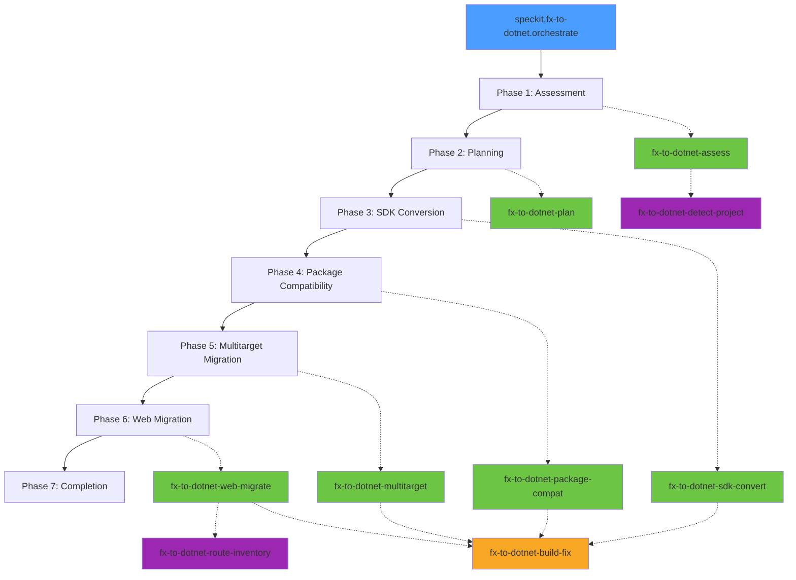

# fx-to-dotnet Extension Family

A family of **11 standalone Spec Kit extensions** that together orchestrate migrating .NET Framework applications to modern .NET (e.g. .NET 10) through a 7-phase workflow.

## Phase Diagram



## Extensions

| Extension | Command | Description |
|-----------|---------|-------------|
| `fx-to-dotnet` | `speckit.fx-to-dotnet.orchestrate` | Orchestrator — drives 7-phase flow |
| `fx-to-dotnet-assess` | `speckit.fx-to-dotnet-assess.assess` | Phase 1: Assessment |
| `fx-to-dotnet-plan` | `speckit.fx-to-dotnet-plan.plan` | Phase 2: Migration planning |
| `fx-to-dotnet-sdk-convert` | `speckit.fx-to-dotnet-sdk-convert.convert` | Phase 3: SDK-style conversion |
| `fx-to-dotnet-build-fix` | `speckit.fx-to-dotnet-build-fix.fix` | Cross-cutting: build/fix loop |
| `fx-to-dotnet-package-compat` | `speckit.fx-to-dotnet-package-compat.update` | Phase 4: Package compatibility |
| `fx-to-dotnet-multitarget` | `speckit.fx-to-dotnet-multitarget.migrate` | Phase 5: Multitarget migration |
| `fx-to-dotnet-web-migrate` | `speckit.fx-to-dotnet-web-migrate.migrate` | Phase 6: ASP.NET web migration |
| `fx-to-dotnet-detect-project` | `speckit.fx-to-dotnet-detect-project.detect` | Utility: project type detection |
| `fx-to-dotnet-route-inventory` | `speckit.fx-to-dotnet-route-inventory.inventory` | Utility: legacy route extraction |
| `fx-to-dotnet-policies` | `speckit.fx-to-dotnet-policies.show` | Shared policies + reference docs |

## Install All Extensions

```bash
for ext in fx-to-dotnet fx-to-dotnet-assess fx-to-dotnet-plan fx-to-dotnet-sdk-convert \
           fx-to-dotnet-build-fix fx-to-dotnet-package-compat fx-to-dotnet-multitarget \
           fx-to-dotnet-web-migrate fx-to-dotnet-detect-project fx-to-dotnet-route-inventory \
           fx-to-dotnet-policies; do
  specify extension add $ext
done
```

### Dev Install (from local checkout)

```bash
for ext in fx-to-dotnet fx-to-dotnet-assess fx-to-dotnet-plan fx-to-dotnet-sdk-convert \
           fx-to-dotnet-build-fix fx-to-dotnet-package-compat fx-to-dotnet-multitarget \
           fx-to-dotnet-web-migrate fx-to-dotnet-detect-project fx-to-dotnet-route-inventory \
           fx-to-dotnet-policies; do
  specify extension add --dev /path/to/$ext
done
```

## Prerequisites

- **Spec Kit** >= 0.5.0
- **.NET SDK** (for `dotnet build` via the build-fix extension)
- **MCP Servers** (required by assessment and SDK conversion extensions):
  - `Microsoft.GitHubCopilot.AppModernization.Mcp` — project analysis and SDK conversion
  - `Swick.Mcp.Fx2dotnet` — NuGet package compatibility data

### Sample MCP Configuration (`.mcp.json`)

```json
{
  "servers": {
    "Microsoft.GitHubCopilot.AppModernization.Mcp": {
      "type": "stdio",
      "command": "dotnet",
      "args": ["run", "--project", "<path-to-appmod-mcp-server>"]
    },
    "Swick.Mcp.Fx2dotnet": {
      "type": "stdio",
      "command": "dotnet",
      "args": ["run", "--project", "<path-to-fx2dotnet-mcp-server>"]
    }
  }
}
```

## Dependency Graph

```
fx-to-dotnet (orchestrator)
├── fx-to-dotnet-assess
│   ├── fx-to-dotnet-detect-project
│   └── fx-to-dotnet-policies
├── fx-to-dotnet-plan
│   └── fx-to-dotnet-policies
├── fx-to-dotnet-sdk-convert
│   └── fx-to-dotnet-build-fix
│       └── fx-to-dotnet-policies
├── fx-to-dotnet-package-compat
│   └── fx-to-dotnet-build-fix
├── fx-to-dotnet-multitarget
│   ├── fx-to-dotnet-build-fix
│   └── fx-to-dotnet-policies
└── fx-to-dotnet-web-migrate
    ├── fx-to-dotnet-route-inventory
    ├── fx-to-dotnet-build-fix
    └── fx-to-dotnet-policies
```

## Standalone Usage

Some extensions can be used independently outside the full migration suite:

- **`fx-to-dotnet-build-fix`** — Useful for any .NET project; iteratively builds and fixes compilation errors
- **`fx-to-dotnet-detect-project`** — Classifies any .NET project (SDK-style, web host, service, library, etc.)
- **`fx-to-dotnet-route-inventory`** — Extracts endpoint inventory from any legacy ASP.NET web project

## License

MIT
